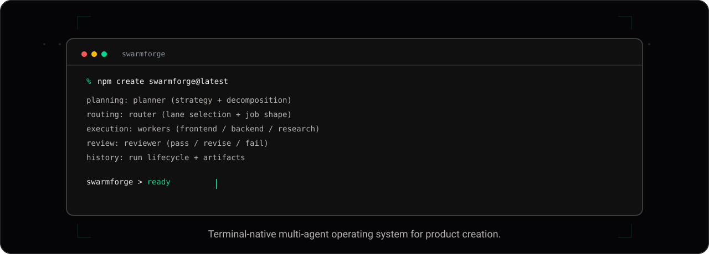
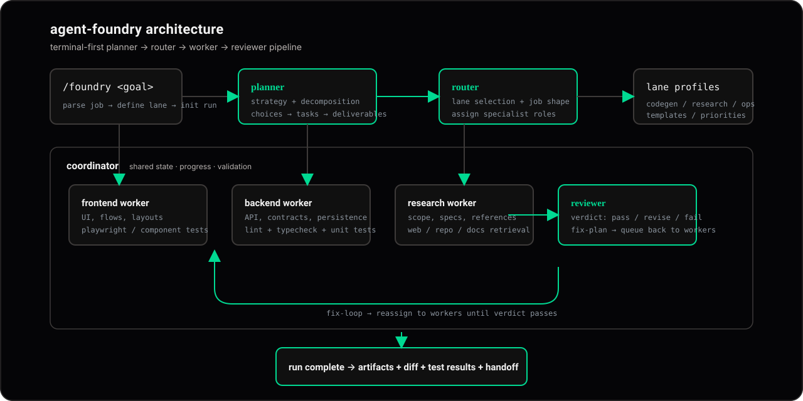

# Agent Foundry

<p align="center">
  
</p>

<div align="center">

**An LLM-operated product factory with a clean planner → router → worker → reviewer architecture.**

[](https://www.typescriptlang.org/)
[](https://nodejs.org/)
[](https://xiaomimimo.com/)
[](#status)

</div>

---

## Overview

Agent Foundry is a TypeScript monorepo that turns an idea into a reviewed multi-task build run, driven by an LLM.

**planner → router → worker swarm → reviewer**

Each lane has its own responsibility, its own model choice, and its own contract:

- **Planner** decomposes the idea into a typed task graph
- **Router** decides whether each task is reasoning-heavy, execution-heavy, or hybrid
- **Worker swarm** executes tasks against skill prompts
- **Reviewer** judges each output against acceptance criteria
- **Run history + metrics** capture the full lifecycle

The whole pipeline is observable, replayable, and persisted to disk.

---

## What's different now

The repo used to be a deterministic scaffold — Planner returned 3 hardcoded tasks regardless of input, Reviewer always approved. **That's changed.** All three reasoning layers now call a real LLM (Xiaomi MiMo, OpenAI-compatible endpoint) with structured prompts and parsed JSON responses.

Each layer falls back to a deterministic stub when no API key is set, so tests and CI run without burning tokens.

---

## Current state

| Capability | Status |
| --- | --- |
| Typed schemas | done |
| Planner → router → worker → reviewer flow | done |
| **LLM-backed Planner** (MiMo) | done |
| **LLM-backed Worker** (MiMo) | done |
| **LLM-backed Reviewer** (MiMo) | done |
| File-based run persistence | done |
| HTTP API (`/runs` CRUD + replay) | done |
| Real retry semantics (replay only failed tasks) | done |
| Skill registry | done |
| Typed SDK client | done |
| Cost + token tracking per run | done |
| Operator dashboard (Vite + React) | done |
| MCP server (stdio) exposing runs as tools | done |
| Model-aware router (tier-based model selection) | done |
| Rubric scoring per acceptance criterion | done |
| Async POST + SSE streaming to dashboard | done |
| Lane-specific worker personas (frontend/backend/data/assets/review) | done |
| In-process queue (p-queue) with concurrency cap + queue stats endpoint | done |
| Artifact storage — workers write real files to disk per task | done |
| CI workflow (`.github/workflows/test.yml`) | done |
| ESLint flat config | done |
| Multi-stage Dockerfile | done |
| Stub fallback when no API key | done |
| 32 tests across 8 suites | passing |
| Queue-backed execution | not yet |
| Auth / billing / workspaces | not yet |
| Model-aware router policies | not yet |

---

## Architecture

<p align="center">
  
</p>

> Style: VoltAgent-style devtools aesthetic — near-black canvas `#08080b`, glass surfaces, emerald `#34e2a4` accent with subtle violet/amber/sky semantics.

LLM injection points:

```
idea
 │
 ▼
[Planner] ──── MiMo (mimo-v2.5-pro) → decomposes into 3–6 TaskSpec[]
 │
 ▼
[Router]  ──── deterministic policy → RoutingDecision per task
 │
 ▼
[Worker swarm] ─ MiMo (mimo-v2.5) → executes against skill prompt
 │
 ▼
[Reviewer] ─── MiMo (mimo-v2.5-pro) → approves or requests changes
 │
 ▼
OrchestrationRun (persisted to runs/)
```

Each LLM call records actual token usage and cost; the run aggregates totals.

---

## Quick start

### 1. Install

```bash
npm install
```

### 2. Configure MiMo (optional but recommended)

Copy `.env.example` to `.env` and fill in your endpoint + key:

```bash
cp .env.example .env
```

```env
MIMO_BASE_URL=https://token-plan-sgp.xiaomimimo.com/v1
MIMO_API_KEY=your-tp-key
MIMO_PLANNER_MODEL=mimo-v2.5-pro
MIMO_WORKER_MODEL=mimo-v2.5
MIMO_REVIEWER_MODEL=mimo-v2.5-pro
```

Without a key, the system runs deterministic stub agents.

### 3. Run the API

```bash
npm run api
```

Listens on `http://localhost:3210`. Persists runs to `./runs/*.json`.

Endpoints:
- `POST /runs` — create a run from an idea. Returns 202 + `{ id, status: "running" }` immediately. Add `?wait=true` to block until completion (returns 201 + full run; used by SDK and MCP server).
- `GET /runs` — list summaries
- `GET /runs/:id` — fetch full run (current state if in-flight)
- `GET /runs/:id/stream` — Server-Sent Events: `queued`, `started`, `planned`, `routed`, `task-started`, `task-completed`, `task-reviewed`, `history`, `done`. The dashboard consumes this for live updates.
- `GET /queue` — current `{ concurrency, size (waiting), pending (active), paused }`.
- `GET /runs/:id/artifacts` — list artifacts produced by the run (`{ taskId, path, sizeBytes, sha256, contentType }`).
- `GET /runs/:id/artifacts/:taskId/:path` — download the raw file content. Paths are validated (no traversal, no absolute paths) and stored under `./artifacts/<runId>/<taskId>/<path>`.
- `POST /runs/:id/retry` — async retry; `?wait=true` blocks. Replays only the failed tasks (preserves approved ones).

### 4. Run the dashboard

```bash
npm run dashboard
```

Operator UI at `http://localhost:5173`. Proxies `/runs` to the API.

### 5. Run the headless demo

```bash
npm run demo
```

Runs a sample idea through the full pipeline and prints the run JSON.

### 6. Run tests

```bash
npm test
```

All tests use mocked fetch or stub fallback — no live LLM calls in CI.

### 7. Expose runs to other agents via MCP

Agent Foundry ships an MCP server (`services/mcp`) that lets other LLM agents call the run pipeline as tools.

```bash
npm run mcp
```

Wire it into Claude Code by adding to your `.mcp.json` or via the CLI:

```bash
claude mcp add agent-foundry node --env-file=.env --import tsx services/mcp/src/server.ts
```

Available tools: `create_run`, `list_runs`, `get_run`, `retry_run`.

---

## Repo structure

```text
Agent-Foundry/
├── apps/
│   ├── dashboard/        # Vite + React + TS operator UI
│   └── web/              # public-facing shell (stub)
├── packages/
│   ├── schemas/          # shared typed contracts
│   ├── llm/              # MiMo OpenAI-compatible client
│   ├── prompts/          # skill registry + prompt templates
│   ├── sdk/              # typed HTTP client (createRun, getRun, retry…)
│   ├── ui/               # placeholder
│   └── config/           # placeholder
├── services/
│   ├── orchestrator/     # Planner + Router + Orchestrator
│   ├── worker/           # WorkerExecutor (LLM-backed)
│   ├── reviewer/         # Reviewer (LLM-backed)
│   ├── http/             # Express API + MemoryRunStore + FileRunStore
│   └── mcp/              # stdio MCP server exposing runs as tools
├── tests/                # 8 suites — http-api, file-store, metrics,
│                         #            sdk, skill-registry, llm-client, …
├── infra/                # docker + github reference stubs
├── .github/workflows/    # CI: lint + build + test
├── Dockerfile            # multi-stage build for the HTTP API
└── eslint.config.js
```

---

## Schema contracts

Defined in `packages/schemas/src/index.ts`:

- `ProjectBlueprint` — `{ id, idea, summary, lanes, tasks }`
- `TaskSpec` — `{ id, title, lane, objective, dependencies[], acceptanceCriteria[], outputs[] }`
- `RoutingDecision` — `{ taskId, mode: reasoning|execution|hybrid, owner, reason, rubricReady }`
- `WorkerJob` — `{ id, taskId, lane, status, route }`
- `WorkerResult` — `{ jobId, taskId, lane, status, summary, producedFiles[], metrics? }`
- `ReviewDecision` — `{ taskId, status: approved|changes_requested, notes[] }`
- `JobMetrics` — `{ tokensUsed, costUsd, durationMs }`
- `RunMetrics` — `{ totalTokens, totalCostUsd, jobCount, approvedCount, changesRequestedCount }`
- `OrchestrationRun` — full lifecycle including `routingDecisions[]`, `jobs[]`, `results[]`, `reviews[]`, `history[]`, `metrics`, `retryOf?`

---

## Live example

```bash
curl -X POST http://localhost:3210/runs \
  -H 'Content-Type: application/json' \
  -d '{"idea":"Notion-to-Slack daily digest agent that filters tasks by priority"}'
```

Real planner output (excerpt):

```json
{
  "history": [{
    "stage": "planned",
    "detail": "Planner created 6 tasks: Build an agent that pulls Notion tasks, filters them by priority, and sends a daily digest message to a Slack channel."
  }],
  "reviews": [
    {
      "taskId": "task-02",
      "status": "changes_requested",
      "notes": [
        "Worker summary lacks details on implementation and test coverage.",
        "No evidence provided that filters.py and test_filters.py contain required logic and tests."
      ]
    },
    {
      "taskId": "task-03",
      "status": "approved",
      "notes": [
        "File created at specified location.",
        "Function generates Slack Block Kit JSON with header, date, and grouped tasks.",
        "Handles empty list with fallback message."
      ]
    }
  ],
  "metrics": {
    "totalTokens": 3354,
    "totalCostUsd": 0.002683,
    "jobCount": 6,
    "approvedCount": 2,
    "changesRequestedCount": 4
  }
}
```

Notice that Reviewer judgments are **per-task and specific** — it cites actual missing artifacts. `POST /runs/:id/retry` will then replay only the 4 failed tasks, preserving the 2 approved ones.

---

## Stub vs LLM mode

| Behavior | Stub mode (no key) | LLM mode (MiMo) |
| --- | --- | --- |
| Planner | 3 hardcoded tasks | 3–6 tasks dynamically generated from the idea |
| Worker | template string per lane | real summary generated by `mimo-v2.5` |
| Reviewer | passes if any output declared | per-criterion judgment with actionable notes |
| Tokens / cost | estimated from output count | real `usage.total_tokens` from response |
| Run duration | ~50ms | ~60–90s (6 tasks × planner + worker + reviewer calls) |
| Tests | passes | not exercised in CI |

The mode is selected automatically by presence of `MIMO_API_KEY`.

---

## Docker

```bash
docker build -t agent-foundry .
docker run -p 3210:3210 \
  -e MIMO_BASE_URL="$MIMO_BASE_URL" \
  -e MIMO_API_KEY="$MIMO_API_KEY" \
  -v "$(pwd)/runs:/data/runs" \
  agent-foundry
```

Runs are persisted to the mounted `/data/runs` volume.

---

## Design principles

- **Contracts first** — every layer speaks typed schemas, not free-form strings
- **Reasoning is expensive** — route clear tasks to a cheaper model, keep judgment for the strong model
- **Review must be explicit** — never silently accept worker output
- **Replay must be cheap** — retry replays only failed tasks, not whole runs
- **Observability is non-negotiable** — every run is a JSON document on disk
- **Stub everything** — every LLM call has a deterministic fallback so CI stays free

---

## Roadmap

### Phase 1 — Foundation ✓
- typed contracts
- orchestration flow
- routing decisions
- run history shape
- LLM-backed planner / worker / reviewer

### Phase 2 — Runtime ✓
- persistent file-based run storage
- HTTP API
- retry / replay flow with failed-task isolation
- typed SDK client
- operator dashboard

### Phase 3 — Specialization
- [x] lane-specific workers (frontend/backend/data/assets/review/planner/router personas with per-lane persona, temperature, and token budget)
- [x] model-aware router policies (tier-based: execution→fast, hybrid→standard, reasoning→pro)
- [x] in-process queue with concurrency cap (`QUEUE_CONCURRENCY` env, default 4). BullMQ/Redis-backed durable queue is a future swap-in.
- [x] richer reviewer rules with rubric scoring (0–5 per criterion, weighted average)
- [x] streaming run updates to the dashboard (SSE; planned/routed/task-started/task-completed/task-reviewed/done events)

### Phase 4 — Productization
- [ ] auth + team workspaces
- [ ] billing / usage tracking
- [x] MCP server exposing `/runs` to other agents (stdio; hosted SSE TBD)
- [x] artifact storage (worker-produced files actually written to disk under ./artifacts/<runId>/<taskId>/, downloadable via /runs/:id/artifacts/:taskId/:path)

---

## Status

Working prototype with real LLM execution. Not production-grade. Use it as:

- a starter for your own agentic SaaS factory
- an internal operator tool for multi-lane LLM workflows
- a reference architecture for the planner/router/worker/reviewer pattern
- a sandbox for testing prompt engineering across multiple roles

---

## License / usage

Use freely as a starter for your agentic systems, internal operator tools, or experimental product automation stacks.
